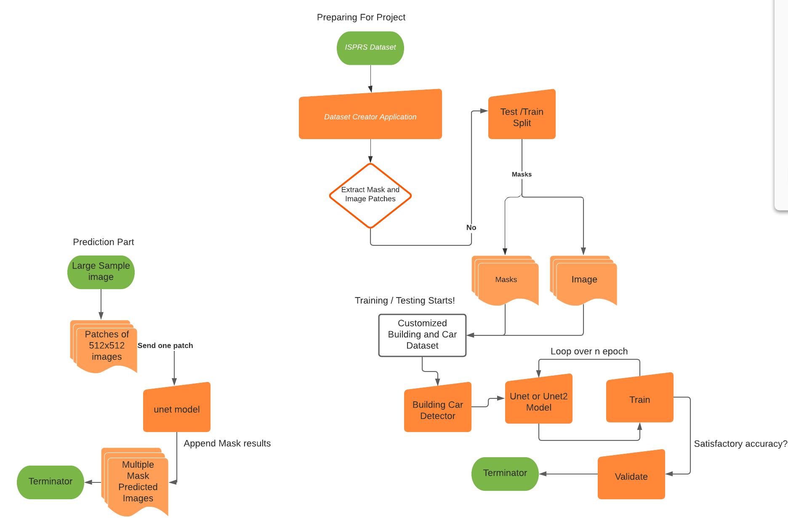
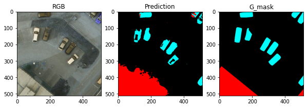
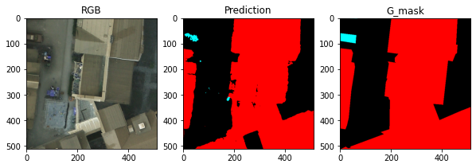
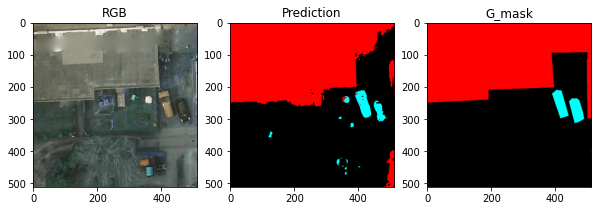
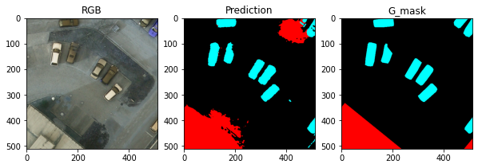
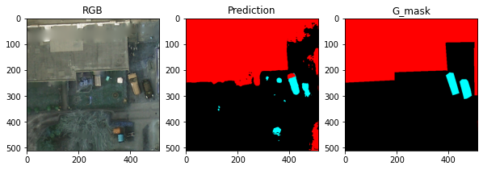
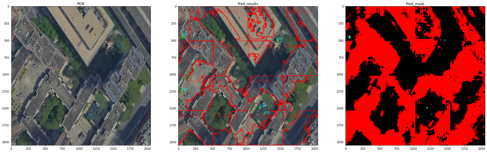
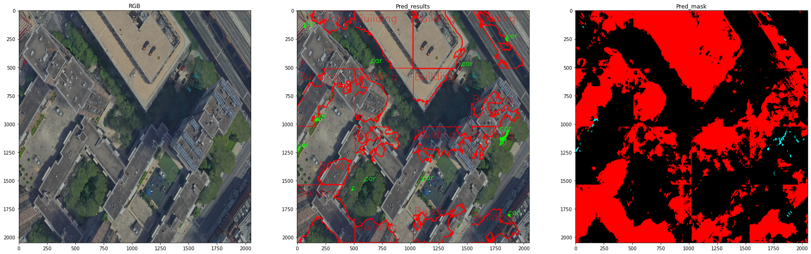

# Building_Car_Detector_ISPRS

DL model to detect Cars and Building using Unet and Unet2 Image Segmentation.\
Framework : `Pytorch`.\
Dataset used : `ISPRS Aerial Dataset` [link](https://www2.isprs.org/commissions/comm2/wg4/benchmark/2d-sem-label-potsdam/).\
Programing Language : `Python3.6`.\
## Requirements:

torch>=1.8.1\
numpy>=1.18.5\
sklearn>=0.0\
scikit-learn>=0.23.1\
opencv-python>=4.1.2.30\
tifffile>=2020.5.30\
matplotlib>=3.1.2\
patchify>=0.2.2\

## Approach:

Large TIF files are converted into small patches of required (512 x 512) and (1024 x 1024) size with required mask and fed into network later.
check ```Create_custom_ISPRS_Dataset.py``` for that.

## flow chart:


## Validations:
1. Unet:




2. Unet2:



## Sample Output:
Unet:
Unet2:

## Further Deployment and Optimization:
1. More Model comparisions : RCNN , FCN , SEGnet.

2. Segmentation with Noise , and De-hazing Techniques.

3. Model with Multiband approach - IRRGB and IRRG.

3. Dataset Mixing with other Aerial Dataset e.g: DSLT , COWC.

Contact me: ```uditsangule@gmail.com```


